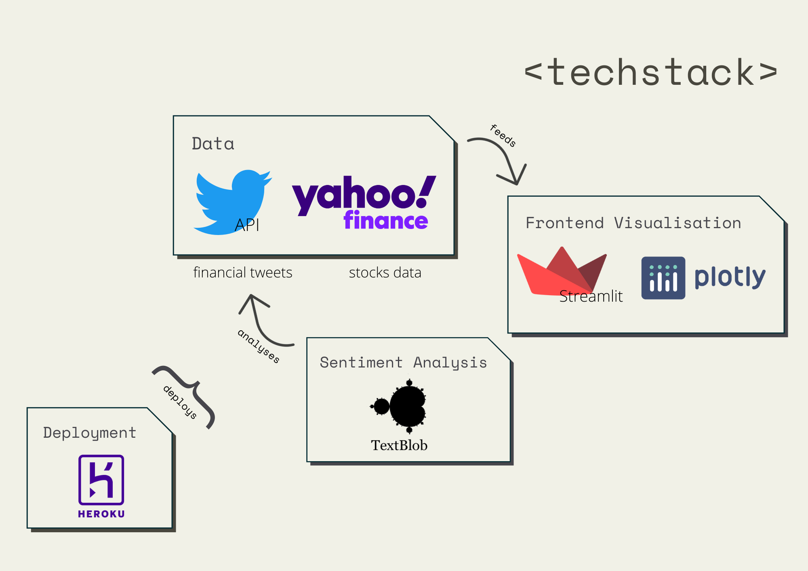

# Financial Sentiment Exploration
> A sentiment analysis application on financial tweets using textblob

## Description
Sometimes, instead of scrolling through countless tweets, we would want a way out to get critical information easier. This application translates the data in text (tweet) into scores that are much comprehendible. These figures represent the sentimentality of the text.

The score scales from a range from -1 to 1:
- 1 - Most positive
- 0 - Neutral
- 1 - Most Negative

Therefore, if a tweet has a score close to 1, it would mean that the tweet is positive. With this logic to analyze financial stock information from tweets, we could quickly gather how others think about the particular stock and make prompt decisions.

## How it works
1. Enter a ticker of interest
2. See the details of the stock if needed
3. Explore the data plotted
> Scores tabulated for a day are average out by the number of tweets gathered for that corresponding day.
4. Explore the raw data that is used
